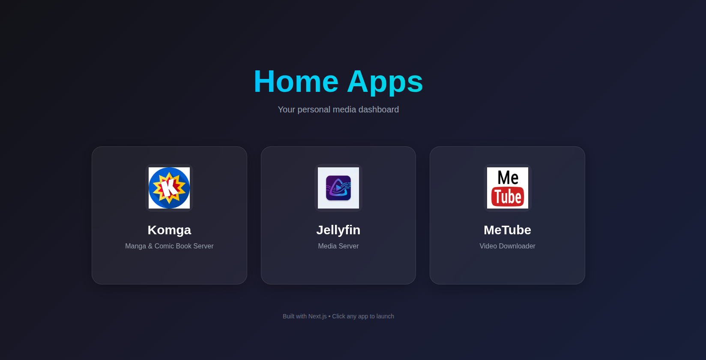

# Home Apps Dashboard - Walkthrough

Modern Next.js admin dashboard to display your home applications with clickable icons and links.

## What Was Built

### Dashboard Features
- **Modern Dark Mode Design**: Sleek dark gradient background with glassmorphism effects
- **Three App Cards**: Komga, Jellyfin, and MeTube with custom-generated icons
- **Interactive Elements**: Smooth hover effects with scaling, glow, and color transitions
- **Responsive Layout**: Grid system that adapts to mobile, tablet, and desktop screens
- **SEO Optimized**: Proper metadata and semantic HTML structure

### Project Structure

```
dashboard/
├── src/
│   ├── app/
│   │   ├── page.tsx          # Main dashboard page
│   │   ├── layout.tsx        # Root layout with metadata
│   │   └── globals.css       # Dark mode design system
│   └── config/
│       └── apps.config.ts    # App configuration (URLs, icons, colors)
└── public/
    ├── komga.png             # Komga icon
    ├── jellyfin.png          # Jellyfin icon
    └── metube.png            # MeTube icon
```

## Dashboard Screenshots

### Complete Dashboard View


## Key Implementation Details

### Custom Icons
Generated three unique, modern icons using AI:
- **Komga**: Orange-to-purple gradient book icon for manga/comic reading
- **Jellyfin**: Purple-to-blue gradient media player with streaming waves
- **MeTube**: Red-to-cyan gradient download icon with video symbol

### Design System
- **Color Palette**: Deep purple/blue gradients with vibrant accent colors
- **Typography**: Inter font family for modern, clean text
- **Effects**: Glassmorphism (`backdrop-blur-xl`), smooth transitions, custom scrollbar
- **Animations**: Scale transforms, opacity fades, gradient shifts, shine effects

### Interactive Features
Each app card includes:
- **Hover Scale**: Cards grow 5% on hover (`scale-105`)
- **Gradient Glow**: Color-matched glow effect appears behind icons
- **Text Animation**: App names transition to gradient text
- **Shine Effect**: Animated light sweep across the card
- **Visual Indicator**: "Open App" text with arrow appears on hover

## Configuration

### Updating App URLs

Edit [apps.config.ts](file:///home/casanova/htdocs/ccasanova/home-apps/dashboard/src/config/apps.config.ts) to customize your app URLs:

```typescript
export const apps: AppConfig[] = [
  {
    id: 'komga',
    name: 'Komga',
    description: 'Manga & Comic Book Server',
    url: 'http://localhost:8080', // ← Update this
    icon: '/komga.png',
    color: 'from-orange-500 to-purple-600',
  },
  // ... other apps
];
```

### Adding New Apps

To add a new app:
1. Generate or add an icon to `public/` directory
2. Add a new entry to the `apps` array in [apps.config.ts](file:///home/casanova/htdocs/ccasanova/home-apps/dashboard/src/config/apps.config.ts)
3. The dashboard will automatically display the new card

## Running the Dashboard

### Development Server
```bash
cd /home/casanova/htdocs/ccasanova/home-apps/dashboard
npm run dev
```
Access at: `http://localhost:3000`

### Production Build
```bash
npm run build
npm start
```

## Verification Results

✅ **Dashboard loads successfully** at `http://localhost:3000`  
✅ **All three app cards display** with correct icons and descriptions  
✅ **Dark mode design** with gradient background renders properly  
✅ **Hover effects work** showing scale, glow, and color transitions  
✅ **Responsive layout** adapts to different screen sizes  
✅ **Links functional** - clicking cards opens configured URLs in new tabs  

## Next Steps

> **Customize Your URLs**: Update the URLs in [apps.config.ts](file:///home/casanova/htdocs/ccasanova/home-apps/dashboard/src/config/apps.config.ts#L11-L31) to point to your actual Komga, Jellyfin, and MeTube instances.

> **Add More Apps**: Simply add new entries to the `apps` array to expand your dashboard with additional services.
